# Trackly - Goal Tracker Dashboard

A modern goal-tracking web app built with React + Vite.

## 🔗 Live Demo
[https://trackly-xxx.vercel.app](https://trackly-blond.vercel.app/)

## 📸 Screenshots

### Desktop View

| Dashboard | Goals List | Create Goal |
|-----------|------------|-------------|
| 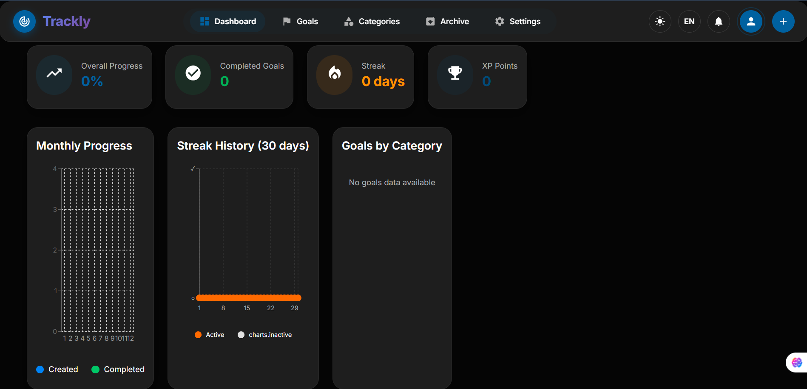 | 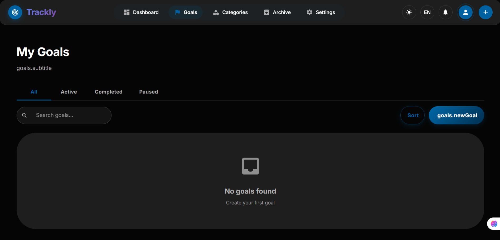 | 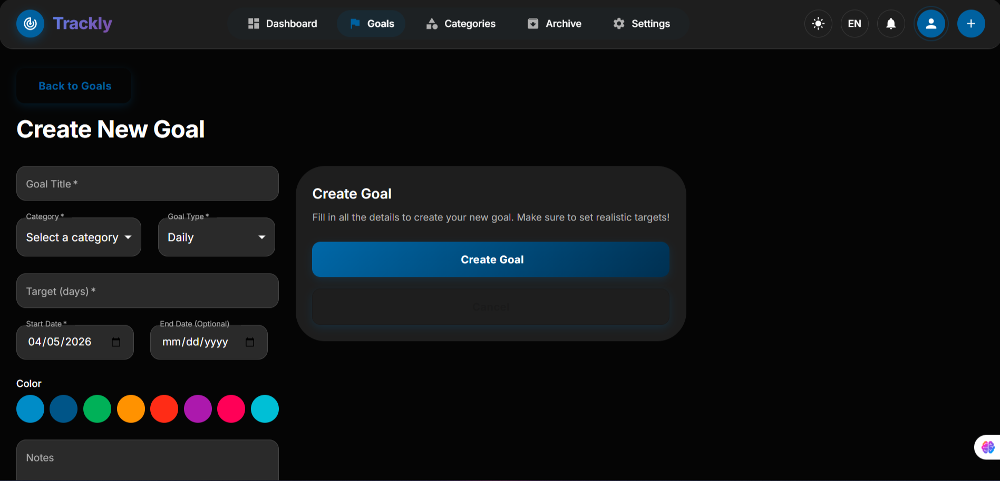 |

| Goal Details | Categories | Settings (RTL) |
|--------------|------------|----------------|
| 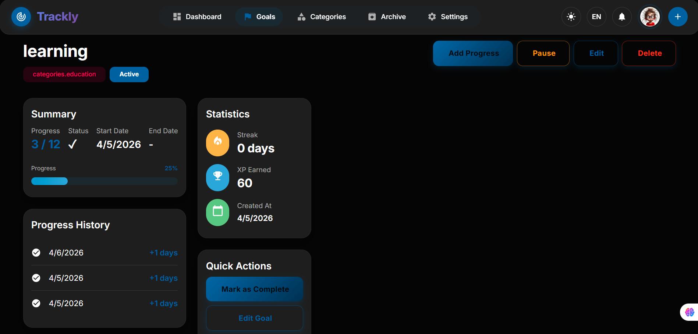 | 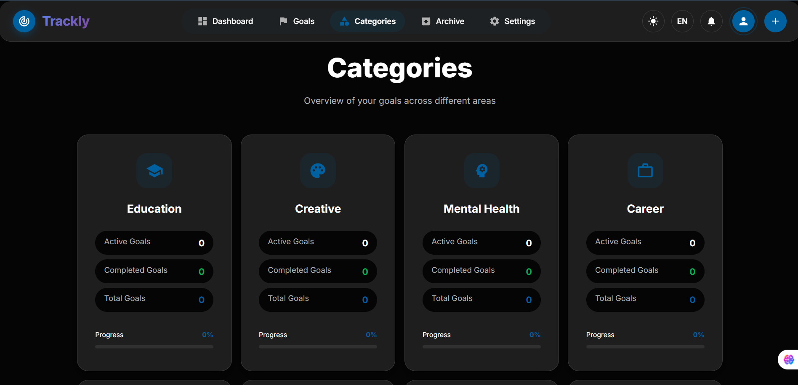 | 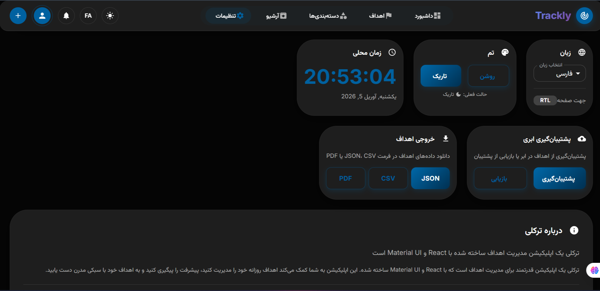 |

### Mobile View

| Dashboard | Create Goal | Goals List |
|-----------|-------------|------------|
| 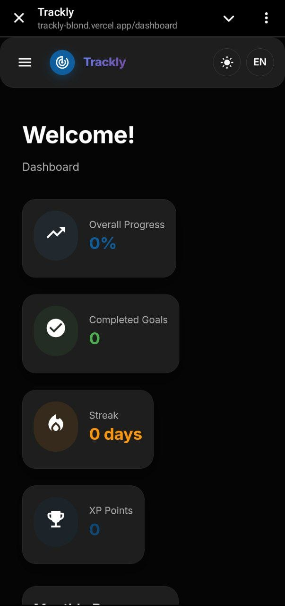 | 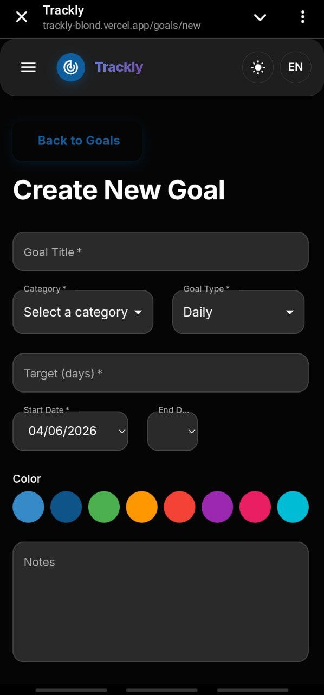 | 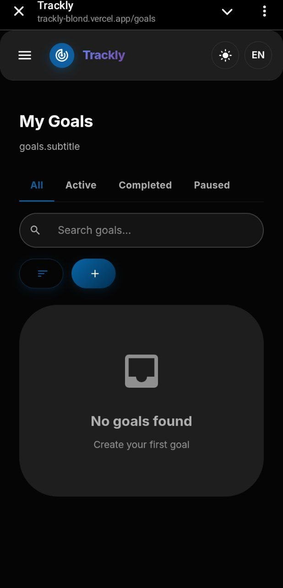 |

| Settings | Archive |
|----------|---------|
| 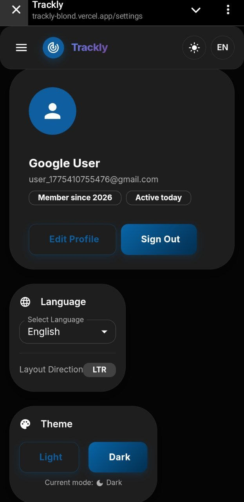 | 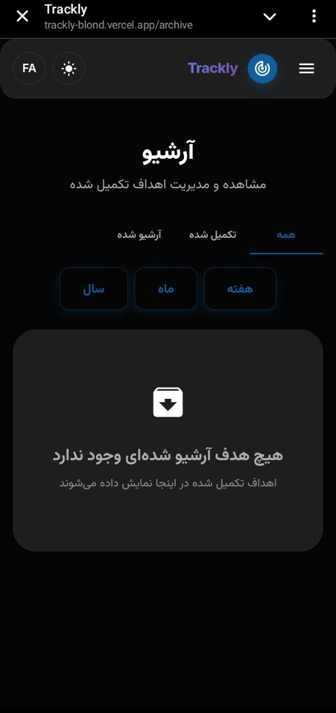 |
## ✨ Features
- Create, edit, delete goals
- Progress tracking with daily logs
- Streak system (consecutive days)
- XP points & gamification
- Archive & restore completed goals
- Export goals (JSON, CSV, PDF)
- Local backup & restore
- RTL/LTR support (English, فارسی, پښتو)
- Light/Dark theme
- Fully responsive
- Toast notifications

## 🛠️ Tech Stack
- React 18 + Vite
- Material UI v5
- React Router v6
- Recharts
- LocalStorage

## 📁 Project Structure
src/

├── components/ # UI components

├── contexts/ # React contexts

├── hooks/ # Custom hooks

├── i18n/ # Translation files

├── pages/ # Page components

├── services/ # Business logic

├── theme/ # MUI theme

└── utils/ # Helper functions

## 🚀 How to Run
```bash
git clone https://github.com/fatemaahm4di/trackly.git
cd trackly
npm install
npm run dev
```
🌐 Language & Direction
English → LTR

فارسی / پښتو → RTL

📊 Streak & XP Rules
Streak increases with daily progress

Streak resets if a day is missed

+20 XP per progress entry

📋 Features Checklist
Dashboard with stats and charts

Goals list with filter, search & sort

Create/Edit goal form with validation

Goal details with progress history

Categories overview

Settings (Language, Theme)

Archive page

RTL/LTR support

Responsive design

Toast notifications

Export goals (JSON, CSV, PDF)

👤 Author:

Fatema Ahmadi 
